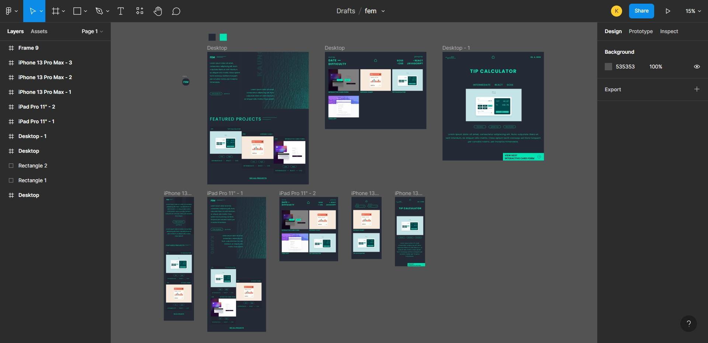
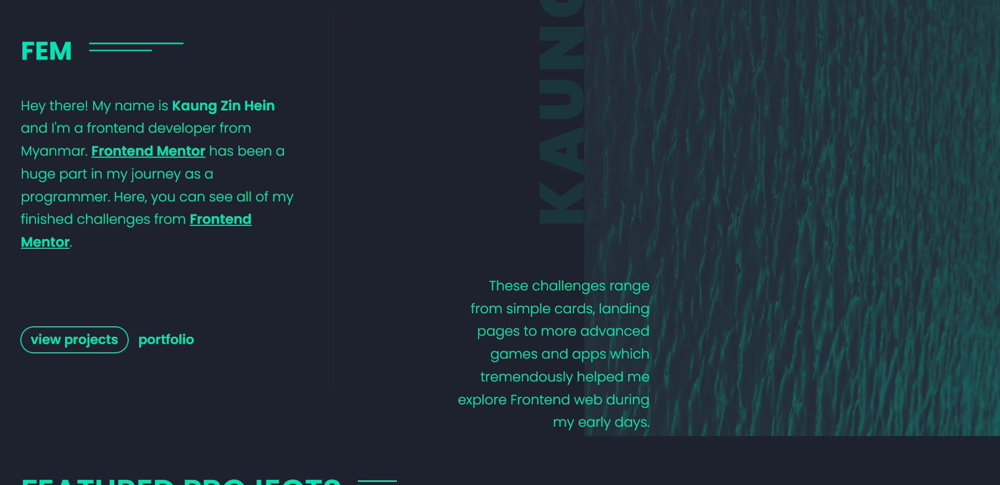

# **
FEM gallery
**
**
A collection of all my completed frontend mentor challenges
**
**
<a href='https://k4ung-fem.netlify.app' >Live site</a>
**

### **Built with**
- React
- CSS module
- Framer Motion
- React router DOM

### **How it started**

The other day, while I was browsing on frontendmentor, I came across a guy who had all his challenges in one single website. And I thought it'd be a great idea to do a gallery for my finished challenges.

### **Idea**

I wanted to display all of my projects in a single website with the ability to sort them by date, difficulty or group them by the languages used. I also wanted to add some featured projects and details for all those projects including my opinions, live demo links, github repo and FEM solution links.

### **Design process**

For the design, I wanted to try something different. I tried making the hero section look unique and a bit minimal. I also tried to use only two colors which was a bit challenging but it turned out nice and great.

### **Coding process**

I did all pages with the `mobile-first` workflow. The styling for the hero section of the home page was a bit tricky to make it responsive. After finishing all the styling, I added extra spice by adding some animation using a library called `framer-motion`. The most tedious part about this project was gathering all the data of the projects by hand into a json file. I was first planning to use Firebase to store the data but I just ended up using a `.json`  file in `src` folder. Then I added all the routings, loaded in all the data and implemented the sorting and group functionalities.

### **Overall opinion**

Overall, I think this was a really great project. I was able to practice my UI/UX skills designing this. This is also my first time using a library for animation so I learned a lot about framer motion as well and overall, it was an enjoyable experience.